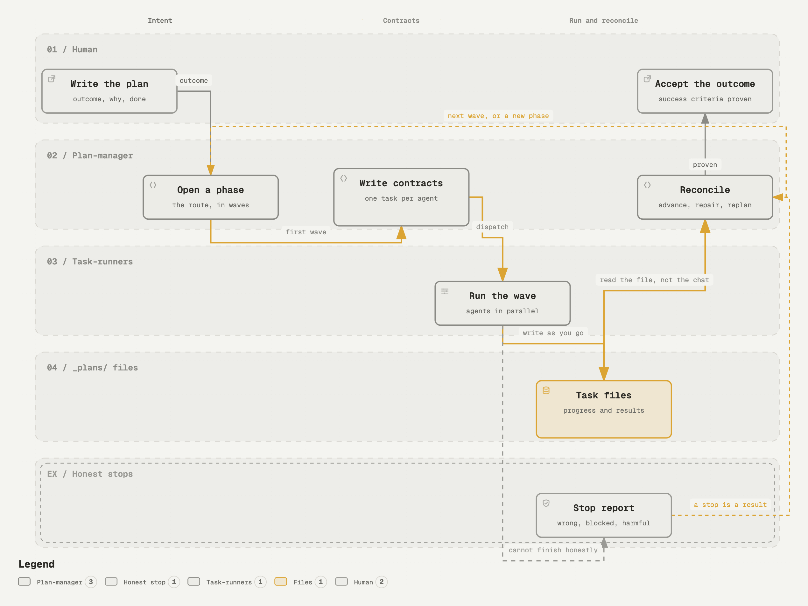

# Plans for agents

A `_plans` folder that keeps AI coding agents from stepping on each other.

Chat is temporary. The plan is the shared memory. Put the goal, the current
route, the task contracts, and the results in files that every agent can read
and update, and you stop being the operating system between them.

## Try it in two minutes

Paste this into the agent you already use: Claude Code, Codex, Gemini CLI,
or anything else that can run git. The folder is plain Markdown, so every
agent reads the same thing.

```text
Clone https://github.com/HiveTechnology/plans-for-agents into a scratch
folder outside my repository and read, in this order: AGENTS.md,
_plans/README.md, .claude/skills/task-run/SKILL.md, then
_plans/001-adopt-plans/ with its phase and its five tasks. Do not change
anything in my repository yet.

Then explain to me, in your own words:
1. what a plan, a phase, and a task each do, and why they are separate files
2. how state stays in those files instead of in this chat
3. how several agents, from different providers, can work one plan at the
   same time without colliding
4. what an honest stop is, and why a stopped task can be a good result

Finish by telling me what adopting _plans in my current repository would
involve, and wait for my go.
```

When you are ready, the next line to give it is "Manage `_plans/001-adopt-plans/`".
That plan walks your repository through adopting the folder and ends with one
real task run through it.



## What is here

- `_plans/`: the folder. An inbox, a place for standalone tasks, and one
  worked plan you can hand to an agent on day one.
- `.claude/skills/`: the five skills that run it: `plan-create`,
  `plan-manage`, `task-create`, `task-run`, `phase-transition`.
- `AGENTS.md`: the rules an agent reads before it touches `_plans/`.
- `_plans/README.md`: the reference. Templates, every frontmatter field,
  lifecycles, stop reasons, the progress protocol.

## Three layers

- **The plan** says what must become true and why. It survives a change of
  route.
- **The phase** is the route being tried right now: which tasks run in
  parallel, which wait, and what discovery would force a replan.
- **The task** is a contract for one agent: scope, files, done criteria,
  validation, and permission to stop.

## Use it

1. Copy `_plans/` and `.claude/skills/` into your repo, or start a new repo
   from this one as a template.
2. Point your agent's instruction file at `AGENTS.md`.
3. Give the agent the adoption plan above, or write your first plan with
   `plan-create`.

The skills are written in Claude Code's skill format. Any other agent reads
them as plain instructions.

## Read more

The article that explains how this came about and why to use it:
[How I structure `_plans` folders for AI coding agents](https://hive.technology/lab-notes/plans-for-agents/).

## License and credit

Copyright Hive Technology, 2026. Released under
[CC BY 4.0](https://creativecommons.org/licenses/by/4.0/). Use it, copy it
into your repos, change it. Keep a credit line that names Hive Technology
and links back here. If your changes make it better, a pull request or a
note is welcome.
